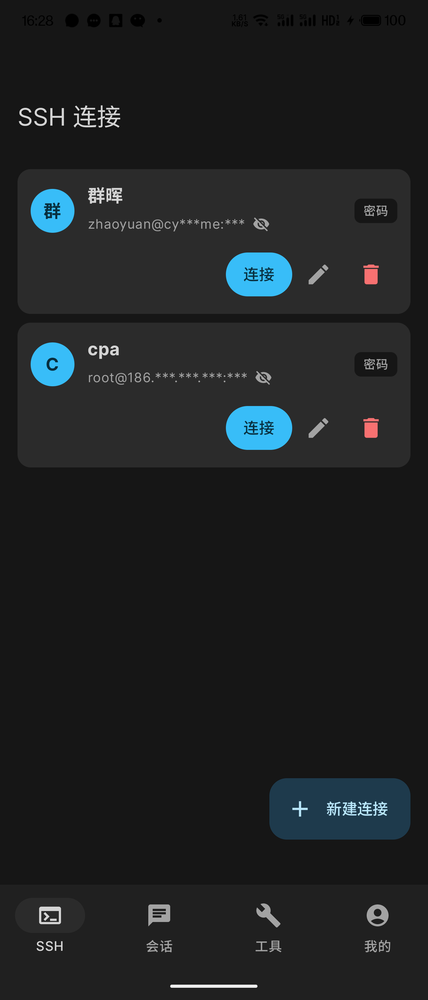
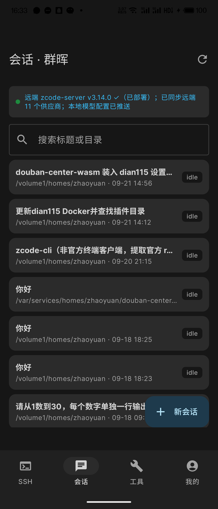
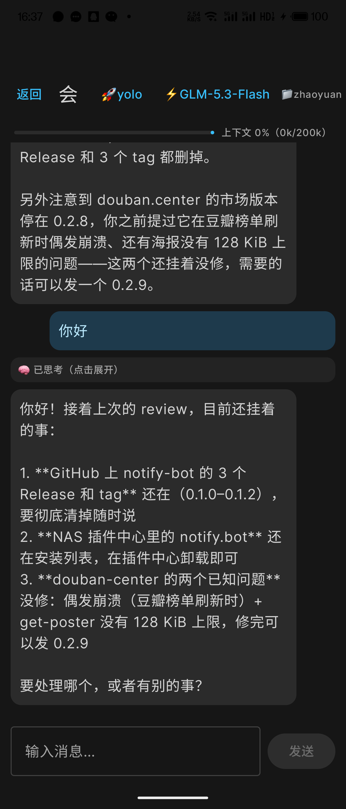
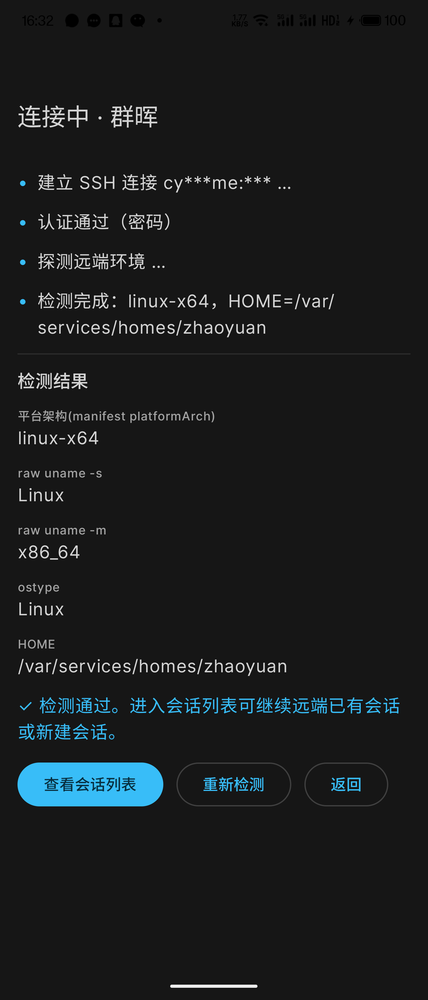
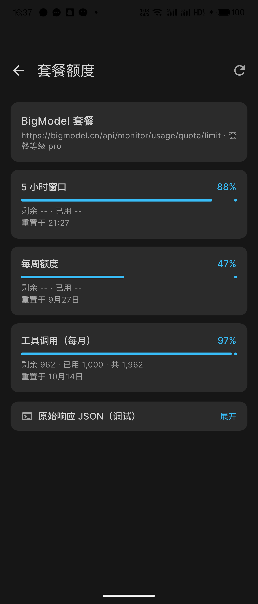
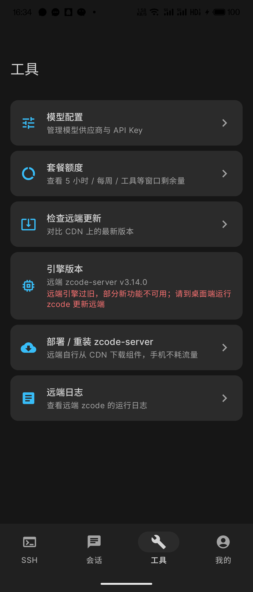

# ZSsh — 安卓远程 ZCode 开发客户端

非官方 Android 客户端：通过 SSH 连接远程 Linux 服务器，直接驱动服务器上的 ZCode 引擎
（`zcode.cjs app-server --stdio`，newline-delimited JSON-RPC over SSH exec channel），
在手机上完成远程 AI 编程开发。不依赖桌面端在线、不走官方中继。

## 演示

| SSH 连接（地址默认脱敏） | 会话列表（与桌面端共享） | 聊天（流式 + 思维链 + 上下文用量） |
| --- | --- | --- |
|  |  |  |

| 连接检测（平台架构识别） | 套餐额度（5 小时 / 每周 / 工具窗口） | 运维工具 |
| --- | --- | --- |
|  |  |  |

## 功能

- **底部 4 Tab**：SSH（连接管理）/ 会话 / 工具 / 我的，全屏沉浸式聊天
- **Zai 双主题**：对齐桌面端 ZCode 的 Zai Dark / Zai Light 配色，跟随系统或手动切换
- **连接管理**：SSH 密码/私钥认证，凭据 EncryptedSharedPreferences 加密存储，连接超时 15s + keepalive 30s
- **环境探测**：uname 检测平台架构（linux-x64 / linux-arm64），远端已部署则版本检查秒过
- **共享会话**：`session/list` 列出远端全部历史会话（与桌面端同一份），任意续聊，支持标题/目录搜索
- **聊天**：流式回复、思维链折叠显示（🧠）、工具卡片、权限弹窗队列
- **模型管理**：供应商列表（API Key/baseURL/模型），远端 ⇄ 手机双向同步，会话内切换模型与思考强度
- **套餐登录（可选）**：Z.ai / BigModel OAuth 登录自动取 Key；不登录也可手动配置任意厂商 Key
- **权限模式**：build/edit/plan/yolo 一键切换（yolo = 全自动免确认）
- **工作目录**：新会话可视化浏览选择远端目录
- **发送队列**：运行中新输入排队，turn 结束自动提交，支持 ⚡插队 / 停止
- **断线处理**：引擎/SSH 断开即时提示，一键重连恢复当前会话
- **运维工具**：检查远端更新、远端日志查看（tail 当天 jsonl + 级别过滤）、部署/重装 zcode-server

### 初始使用

App 不强制登录：首次进入直接在 SSH 页添加服务器连接；连接后如需模型，
可在「工具 → 模型配置」手动添加任意厂商 API Key，或在「我的」页一键登录 Z.ai / BigModel 套餐自动取 Key。

## 技术要点（协议均为实测逆向 + 真机验证）

- 引擎对话协议：`ZCode Protocol v1`（session/create·resume·send·subscribe·setModel·setMode…），
  事件流带单调 seq，订阅支持 afterSeq 断点
- 引擎要求客户端应答反向请求：`session/requestRuntimePreferences`、`interaction/requestPermission`
  （`{decision: allow|deny}`），15s 超时
- 供应商/API Key 配置在远端 `~/.zcode/v2/provider_config.json`（非 cli/config.json）
- 远端引擎独立启动需 `ZCODE_HOME`、`ZCODE_DATA_BASE_DIR`、`ZCODE_BUILTIN_PROVIDER_CONFIG_FILE`
- 安卓特有坑：系统精简版 BouncyCastle 缺 X25519/Ed25519（需注册完整版 BC）；
  sshj 单 session 通道只能执行一条命令（每命令新开 session）

## 构建

```bash
gradle :app:assembleDebug    # JDK 17+，Android SDK 35
# 本机若全局 Gradle 走代理，用隔离 GRADLE_USER_HOME：
GRADLE_USER_HOME=$PWD/.gradle-home gradle :app:assembleDebug --no-daemon
```

minSdk 26（Android 8.0+），Kotlin + Jetpack Compose + sshj。

## 远端前置

- `~/.zcode/server/` 已部署 ZCode 运行时（官方桌面端远程连接过即有；或手动部署）
- 至少一个模型供应商（kimi/BigModel/OpenAI 兼容端点均可），可在 App 内配置推送到远端

## 声明

仅供学习研究，ZCode 为其各自所有者的商标/产品；请遵守官方服务条款。
